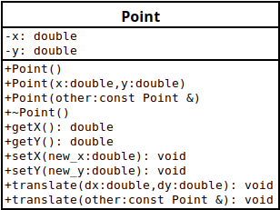

# SMP - TP7

## Création d'une classe point

Voici le diagramme de la classe Point.



Nous commençons par déclarer la class `Point` dans le fichier `Point.h`.

```C++
#pragma once

class Point
{
private:
    double x, y;
public:
    Point(double x, double y);
    Point();
    Point(const Point &other);
    ~Point();
    void translater(const Point &other);
    void translater(double dx, double dy);
    double getX();
    double getY();
    void setX(double new_x);
    void setY(double new_y);
};
```

Ensuite, nous définissons les méthodes particulières soit les Constructeurs et le Déconstructeur.

Pour le troisième construction, on a `const Point &other`. Ceci permet avec le `&` de demander une référence sur l'objet au lieu de le recopier. Le `const` permet d'indiquer que l'on ne modifie pas l'objet référencé.

```C++
Point::Point(double x, double y)
{
    this->x = x;
    this->y = y;
}

Point::Point()
{
    this->x = 0;
    this->y = 0;
}

Point::Point(const Point &other)
{
    this->x = other.x;
    this->y = other.y;
}

Point::~Point() {}
```

Enfin, on définie le reste des méthodes.

```C++
void Point::translater(const Point &other)
{
    this->x += other.x;
    this->y += other.y;
}

void Point::translater(double dx, double dy)
{
    this->x += dx;
    this->y += dy;
}

double Point::getX() { return this->x; }

double Point::getY() { return this->y; }

void Point::setX(double new_x) { this->x = new_x; }

void Point::setY(double new_y) { this->y = new_y; }
```

Nous testons maintenant tester notre classe.

```C++
int main()
{
    Point p = Point(5,6);
    std::cout << "La valeur de x est " << p.getX() << std::endl;
    std::cout << "La valeur de y est " << p.getY() << std::endl;
    p.translater(12,3);
    std::cout << "Apres translation la valeur de x est " << p.getX() << std::endl;
    std::cout << "Apres translation la valeur de y est " << p.getY() << std::endl;
}
```

On obtient le résultat suivant.

```
La valeur de x est 5
La valeur de y est 6
Apres translation la valeur de x est 17
Apres translation la valeur de y est 9
```

## Surcharge d'Opérateurs

On ajoute les prototypes des opérateurs surchargés.

```C++
class Point
{
    [...]
public:
    [...]
    friend std::ostream &operator<<(std::ostream &os, const Point &p);
    void operator+=(const Point &a);
};
```

On définie ensuite les surcharges d'opérateurs.

```C++
std::ostream& operator<<(std::ostream& os, const Point &p)
{
    os << "Point(" << p.x << "," << p.y << ")";
    return os;
}

void Point::operator+=(const Point &a)
{
    this->x += a.x;
    this->y += a.y;
}
```

On fini par tester notre implémentation.

```C++
int main()
{
    Point p = Point(17,9);
    std::cout << p << std::endl;
    Point v = Point(5,6);
    std::cout << v << std::endl;
    p += v;
    std::cout << p << std::endl;
}
```

Résultat :
```
Point(17,9)
Point(5,6)
Point(22,15)
```

## Formes Géométriques Abstraites

L'objectif ici est de créer une class abstraite standardisant les différentes formes.

